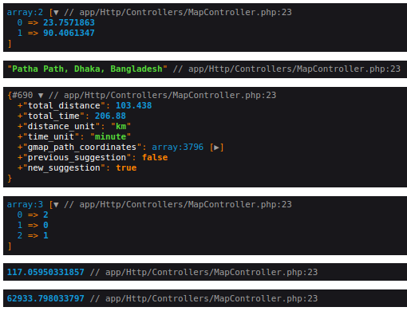

## Collection of Map utilities & Google Maps API Web Services for Laravel

Provides convenient way of setting up and making requests to Maps API from [Laravel](http://laravel.com/) application.
For services documentation, API key and Usage Limits visit [Google Maps API Web Services](https://developers.google.com/maps/documentation) and [Maps API for Terms of Service License Restrictions](https://cloud.google.com/maps-platform/terms).

Features
------------
* [Directions API](https://developers.google.com/maps/documentation/directions/)
* [Distance Matrix API](https://developers.google.com/maps/documentation/distance-matrix/)
* [Elevation API](https://developers.google.com/maps/documentation/elevation/overview)
* [Geocoding API](https://developers.google.com/maps/documentation/geocoding/)
* [Geolocation API](https://developers.google.com/maps/documentation/geolocation/overview)
* [Roads API](https://developers.google.com/maps/documentation/roads/)
* [Time Zone API](https://developers.google.com/maps/documentation/timezone/overview)
* [Places API Web Services](https://developers.google.com/maps/documentation/places/web-service)


Dependency
------------
* [PHP cURL](http://php.net/manual/en/curl.installation.php)
* [PHP >= 7.3.0](http://php.net/)

Installation
------------

Issue following command in console:

```php
composer require shaonmajumder/map-box
```

Alternatively  edit composer.json by adding following line and run **`composer update`**
```php
"require": {
		....,
		"shaonmajumder/map-box":"^0.0",

	},
```

Configuration
------------

Register package service provider and facade in 'config/app.php'

```php
'providers' => [
    ...
    Shaon\ServiceProvider\MapBoxServiceProvider::class,
]

'aliases' => [
    // Other aliases...

    'MapBox' => Shaon\Facades\MapBox::class,
],

```
NB: This is optional for latest version php and laravel


Publish configuration file using 
```bash
php artisan vendor:publish --tag=config
```
or simply copy package configuration file and paste into **`config/mapbox.php`**

Open configuration file **`config/mapbox.php`** and add your service key
```php
    /*
    |----------------------------------
    | Service Keys
    |------------------------------------
    */

    'google_map_api_key'       => 'ADD YOUR GOOGLE MAP KEY HERE',
```

If you like to use different keys for any of the services, you can overwrite master API Key by specifying it in the `service` array for selected web service.


Usage
------------

```php
use Shaon\Facades\MapBox;

// Example 1: Get coordinates from an address
$address = '110, South Kamalapur, Dhaka-1217';
$coordinates = MapBox::getCoordinatesFromAddress($address);

// Example 2: Get an address from coordinates
$latlongString = '23.726533,90.424630';
$address = MapBox::getAddressFromCoordinates($latlongString);

// Example 3: Get waypoints path suggestion
$waypointsArray = [
    [ 23.810052 , 90.416229  ],
    [ 23.9535742, 90.1494988 ],
    [ 23.810052 , 90.416229  ],
    // Add more waypoints as needed
];

$suggestion = MapBox::getWaypointsPathSuggestion($waypointsArray);

// Example 4: Get waypoints Order Optimization - a sorted order of waypoints for best traffic condition
$start = [ 23.726533, 90.424630 ];
$end   = [ 23.726533, 90.424630 ];
$waypointsArray = [
    [ 23.810052 , 90.416229  ],
    [ 23.9535742, 90.1494988 ],
    [ 23.810052 , 90.416229  ],
    // Add more waypoints as needed
];
$order = MapBox::getGMAPWaypointsOrderOptimization($start, $end, $waypointsArray);

// Example 5: Calculate haversine distance between two points
$lat1 = 37.423021;
$lon1 = -122.083739;
$lat2 = 37.421999;
$lon2 = -122.084057;
$distance = MapBox::haversineDistance($lat1, $lon1, $lat2, $lon2);

// Example 6: Calculate total distance from coordinates of waypoints
$waypointsArray = [
    [ 23.810052 , 90.416229  ],
    [ 23.9535742, 90.1494988 ],
    [ 23.810052 , 90.416229  ],
    // Add more waypoints as needed
];
$totalDistance = MapBox::calculateTotalDistanceFromCoordinates($waypointsArray);
```

Here is a working controller which runs all the examples 

```php
<?php

namespace App\Http\Controllers;
// use MapBox\MapBox;
use Shaon\Facades\MapBox;

use Illuminate\Http\Request;

class MapController extends Controller
{
    public function index(){
        dd( 
            $this->example1(),
            $this->example2(),
            $this->example3(),
            $this->example4(),
            $this->example5(),
            $this->example6(),
        );
    }


    public function example1(){
        // Example 1: Get coordinates from an address
        $address = '110, South Kamalapur, Dhaka-1217';
        $coordinates = MapBox::getCoordinatesFromAddress($address);
        return $coordinates;
    }

    public function example2(){
        // Example 2: Get an address from coordinates
        $latlongString = '23.726533,90.424630';
        $address = MapBox::getAddressFromCoordinates($latlongString);
        return $address;
    }

    public function example3(){
        // Example 3: Get waypoints path suggestion
        $waypointsArray = [
            [ 23.810052 , 90.416229  ],
            [ 23.9535742, 90.1494988 ],
            [ 23.810052 , 90.416229  ],
            // Add more waypoints as needed
        ];

        $suggestion = MapBox::getWaypointsPathSuggestion($waypointsArray);
        return $suggestion;
    }

    public function example4(){
        // Example 4: Get waypoints Order Optimization - a sorted order of waypoints for best traffic condition
        $start = [ 23.726533, 90.424630 ];
        $end   = [ 23.726533, 90.424630 ];
        $waypointsArray = [
            [ 23.810052 , 90.416229  ],
            [ 23.9535742, 90.1494988 ],
            [ 23.810052 , 90.416229  ],
            // Add more waypoints as needed
        ];
        $order = MapBox::getGMAPWaypointsOrderOptimization($start, $end, $waypointsArray);
        return $order;
    }

    public function example5(){
        // Example 5: Calculate haversine distance between two points
        $lat1 = 37.423021;
        $lon1 = -122.083739;
        $lat2 = 37.421999;
        $lon2 = -122.084057;
        $distance = MapBox::haversineDistance($lat1, $lon1, $lat2, $lon2);
        return $distance;
    }
    
    public function example6(){
        // Example 6: Calculate total distance from coordinates of waypoints
        $waypointsArray = [
            [ 23.810052 , 90.416229  ],
            [ 23.9535742, 90.1494988 ],
            [ 23.810052 , 90.416229  ],
            // Add more waypoints as needed
        ];
        $totalDistance = MapBox::calculateTotalDistanceFromCoordinates($waypointsArray);
        return $totalDistance;
    }

}
```

The output :


Important Links
-------
# https://app.dghs.gov.bd/bbscode/

Special Thanks
-------
[Shajalal Sazu](https://www.linkedin.com/in/shahjalal-shaju/) ,
[Jibon Bikash Roy](https://www.linkedin.com/in/jibonbikashroy/)

Support
-------

[Please open an issue on GitHub](https://github.com/ShaonMajumder/map-box/issues)

License
-------

Collection of Google Maps API Web Services for Laravel is released under the MIT License. See the bundled
[LICENSE](https://github.com/ShaonMajumder/map-box/blob/master/LICENSE)
file for details.
